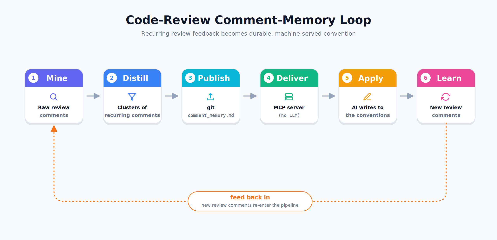

# Team Coding DNA — PR Review Memory

> Mine your team's pull-request review history into a single versioned file, and
> serve it to **any** AI coding tool through an MCP server that runs no model of
> its own — so code is written to your team's conventions *before* review begins.

Senior reviewers repeat the same feedback for years. That feedback is your team's
real engineering standard, but it lives buried in closed PR threads where no tool
can reach it. **Team Coding DNA** mines that history, distills it into
`git_comment_memory.md`, and exposes it over the [Model Context
Protocol](https://modelcontextprotocol.io) so the AI tool you already use can read
the rules *before* it writes a line.

The result: fewer review round-trips, consistent standards across reviewers, and
institutional knowledge that survives when people leave.

---

## Why this isn't "just a linter"

The value is **not** generic advice that any linter or off-the-shelf AI already
gives. The value is the team-specific knowledge that exists nowhere except your
own PR history.

| Generic (a linter already does this) | Team-specific DNA (only your history knows) |
| ------------------------------------- | -------------------------------------------- |
| Add tests                             | Money is always `Decimal`, never `float`     |
| Handle exceptions                     | Don't call the billing API directly — use the gateway wrapper |
| Add type hints                        | New endpoints must register with the rate-limiter |
| Remove `console.log`                  | Use our `retry()` util, not raw requests     |

---

## How it works — a closed loop



1. **Mine** — read git history and GitHub PR review comments (read-only).
2. **Distill** — cluster recurring comments into rules, each with a precedent PR
   and a confidence score (vector-less retrieval; your AI does the summarizing).
3. **Publish** — write the canonical `git_comment_memory.md`, committed to the
   repo so it is versioned and reviewable.
4. **Deliver** — the MCP server exposes the rules as tools and resources.
5. **Apply** — the AI checks the DNA before writing or reviewing code.
6. **Learn** — new review comments feed back; re-mine to tighten the DNA over time.

---

## MCP-first & token-optimized

The MCP server is the primary delivery path, and it **runs no LLM of its own** —
it exposes the rules as tools, and whichever AI tool the developer already uses
does all the reasoning. Because that client model supplies the intelligence, every
token a tool returns is spent from the client's context budget. The server's job
is to change the model's behaviour with the *least text possible*:

- **Scope before returning** — filter by language/path/category; never dump the file.
- **Cap & rank** — at most 8 rules, ranked by `confidence × relevance`.
- **Progressive disclosure** — default response is `id + one-line rule + confidence`;
  full detail only via `get_rule_detail`.
- **Terse output** — compact JSON, not prose.
- **Per-session cache** — repeated calls for the same diff don't re-spend.
- **Merge overlaps** — near-identical rules are de-duplicated.

---

## Install

Requires Python 3.10+ and `git`.

```bash
# from a clone of this repo
pip install -e .

# or isolated, as a CLI
pipx install .
```

This installs the `dna` command and the `team_coding_dna` package.

---

## Quickstart

```bash
# 1. Scaffold a starter DNA file (ships with illustrative rules so the server
#    works immediately). Run inside your project repo.
dna init

# 2. Mine your real PR history (read-only GitHub token required — see below).
#    Put the token in a .env file (auto-loaded) or export it:
cp .env.example .env        # then edit GITHUB_TOKEN — or: export GITHUB_TOKEN=ghp_...
dna mine --repo your-org/your-repo --since 90d

# 3. Turn the mined clusters into rules and merge them into git_comment_memory.md.
dna distill

# 4. Serve the DNA to your AI tool over MCP (stdio).
dna serve
```

Commit `git_comment_memory.md` so the DNA is versioned and reviewable alongside
your code.

---

## Connect your AI tool

The server speaks MCP over stdio, so any MCP-aware client can use it.

**Claude Code**

```bash
claude mcp add team-coding-dna -- dna serve --path /abs/path/to/git_comment_memory.md
```

**Cursor / generic stdio client** (`.cursor/mcp.json` or your client's config):

```json
{
  "mcpServers": {
    "team-coding-dna": {
      "command": "dna",
      "args": ["serve", "--path", "/abs/path/to/git_comment_memory.md"],
      "env": { "GITHUB_TOKEN": "ghp_your_read_only_token" }
    }
  }
}
```

The `env` block is **optional** — it's only needed if you want to mine live from
inside your AI client (see the `mine` tool below). Serving rules needs no token.
You can also drop the token into a `.env` file in the project (auto-loaded) instead
of putting it in the client config. For Claude Code, pass it with
`claude mcp add team-coding-dna -e GITHUB_TOKEN=ghp_... -- dna serve --path ...`.

Then prompt your AI tool to **call `get_relevant_rules` with the diff (or the
files it's about to touch) before writing or reviewing code.**

### What the server exposes

| Kind | Name | Purpose |
| ---- | ---- | ------- |
| Resource | `dna://git_comment_memory.md` | The full DNA file, on demand (never auto-loaded). |
| Tool | `get_relevant_rules(diff, languages?, paths?, category?)` | Scoped, ranked, capped rules for this change as terse JSON. |
| Tool | `get_rule_detail(id)` | Full rationale, example and precedent for one rule. |
| Tool | `mine(repo?, since?, limit?)` | Grouped comment clusters for your model to distill. Fetches **live** from GitHub when a token is present (`GITHUB_TOKEN`/`.env`); otherwise returns the `dna mine` cache. |

> **No token needed to serve rules.** `get_relevant_rules` / `get_rule_detail` only
> read your local `git_comment_memory.md`. A GitHub token is used **only** for
> mining (the `mine` tool or `dna mine`), and only ever read-only.

---

## CLI reference

| Command | What it does |
| ------- | ------------ |
| `dna init [--path FILE] [--force]` | Write a seed `git_comment_memory.md`. |
| `dna mine --repo owner/name [--since 90d] [--limit 50] [--min-count 2] [--token T]` | Fetch + cluster recurring PR review comments (read-only). Caches to `.dna/`. |
| `dna distill [--path FILE] [--model] [--min-count 2]` | Turn cached clusters into rules and merge into the DNA file. |
| `dna serve [--path FILE]` | Start the MCP server over stdio. |

`--since` accepts `90d`, `12w`, `6mo`, `1y`, or an ISO date.

### Optional headless distillation (CI only)

By default distillation is **LLM-less**: `dna distill` derives rules directly from
the clusters, or your AI client does it interactively via the `mine` tool. For
unattended CI you may use *your own* model with `dna distill --model`, configured
via `DNA_MODEL` (e.g. `ollama:llama3.1` or `openai:gpt-4o-mini`). See
[`.env.example`](.env.example). No third-party model is ever bundled.

---

## Security & privacy

- **No bundled model.** At code time, your code is handled only by the AI tool you
  already chose and trust — nothing is sent to a model we picked.
- **Least-privilege GitHub access.** Mining needs only *Pull requests: Read* and
  *Contents: Read*. Never grant write or admin scopes for mining.
- **Secrets are redacted** from comment bodies at fetch time, so nothing sensitive
  reaches the local cache or the committed DNA file. Still review the file before
  committing.
- **The mining cache** (`.dna/`) holds raw comments and is git-ignored by default.

---

## Architecture

```
src/team_coding_dna/
├── cli.py            # `dna` command: init | mine | distill | serve
├── memory.py         # parse/serialize the canonical git_comment_memory.md
├── retrieval.py      # token-optimized scope → rank → cap → dedup (vector-less)
├── mcp_server.py     # FastMCP: resource + 3 tools (runs no LLM)
├── distill.py        # clusters → rules (heuristic, or optional headless model)
├── seeds.py          # illustrative starter rules for `dna init`
└── mining/
    ├── git_source.py    # git CLI: repo detection, local context
    ├── github_source.py # PyGithub (read-only): PR review comments + redaction
    └── cluster.py       # vector-less clustering of recurring comments
```

| Layer | Choice | Why |
| ----- | ------ | --- |
| CLI / engine | Python + Typer | best git/LLM ecosystem; one install |
| Git / PR data | `git` CLI + PyGithub (read-only) | commits, diffs, review comments |
| LLM | none bundled | the client's own AI does the reasoning |
| Retrieval | vector-less: full-text + path/language filters | small corpus; deterministic and explainable |
| MCP server | Python MCP SDK (FastMCP) | live rule access for any MCP-aware client |

---

## Development

```bash
pip install -e ".[dev]"
pytest
```

---

## Roadmap

Shipped here: **mining** + the **MCP server**. Planned next phases:

- Compiled cross-tool adapters (Cursor `.mdc`, Copilot instructions, `CLAUDE.md` /
  `AGENTS.md` managed blocks) for tools that prefer their own files.
- Confidence decay + a learning loop (accepted rules strengthen, ignored rules fade).
- A git/CI hook for scheduled re-mining.
- An npm wrapper for one-line install in JS ecosystems.

## License

MIT
